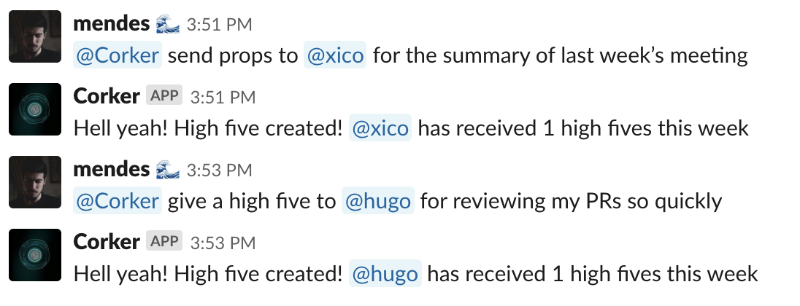

# Corker

[](https://travis-ci.com/includebraga/corker)

Corker is one astonishing boi.

Giving feedback leads to a better workplace. Corker is a Slack bot that listens to your props to other Slack members and records them.

[](https://heroku.com/deploy)



## Roadmap

This is a rough draft of the path the project is taking.

- [x] Send high fives through Slack commands
- [ ] Record reactions from Slack
- [ ] See a feed of org high fives
- [ ] Highest sender & receiver stats

You can find the complete feature and task list in the [project Trello
board][trello].

## Development

We are using [asdf](https://github.com/asdf-vm/asdf) to manage tool
dependencies. Our recommendation is that you also use it, since the
`.tool-versions` is always up to date regarding the languages and respective
versions we are using.

We are also using [direnv](https://github.com/direnv/direnv) to autoload
environment variables.

The project uses the `SLACK_BOT_OAUTH_TOKEN` env variable. You can choose not to
use `direnv`, but you **must** have this variable available.

To get a bot OAuth token, follow [this guide](https://hexdocs.pm/slack/token_generation_instructions.html).

```shell
git clone https://github.com/includebraga/corker.git
bin/setup # this sets up pretty much everything
bin/server # this runs the project
```

And done! You are ready to rock.

If you intend on making a contribution, don't forget to run `bin/lint`

## Contributing

Feel free to contribute.

If you found a bug, open an issue. You can also open a PR for bugs or new
features. Your PRs will be reviewed and subject to our style guide and linters.

We have a list of tasks available at the [project
Trello board][trello]. All contributions **must** follow the [Code of
Conduct][coc].

[trello]: https://trello.com/b/lc3PDonO/%F0%9F%92%BB-corker
[coc]: https://github.com/includebraga/corker/blob/master/CODE_OF_CONDUCT.md
